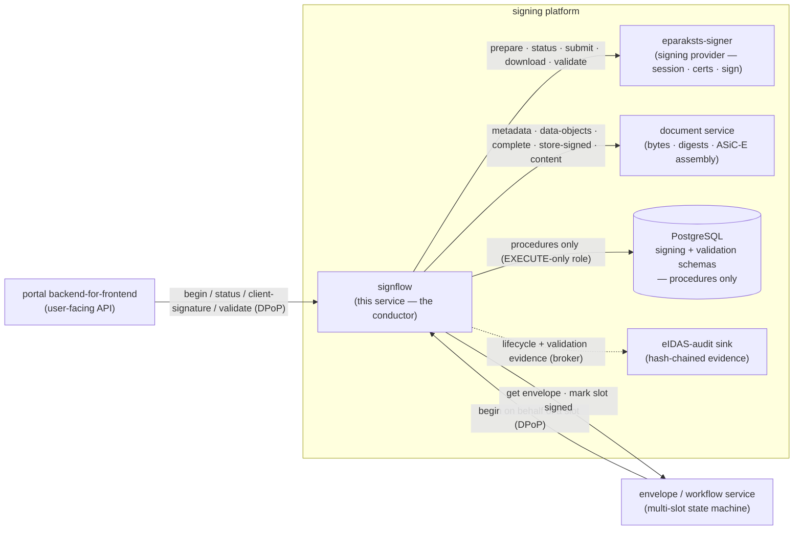
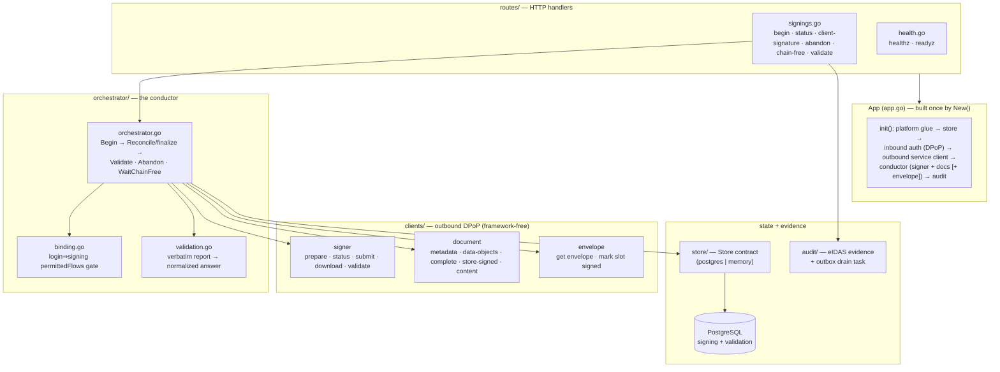
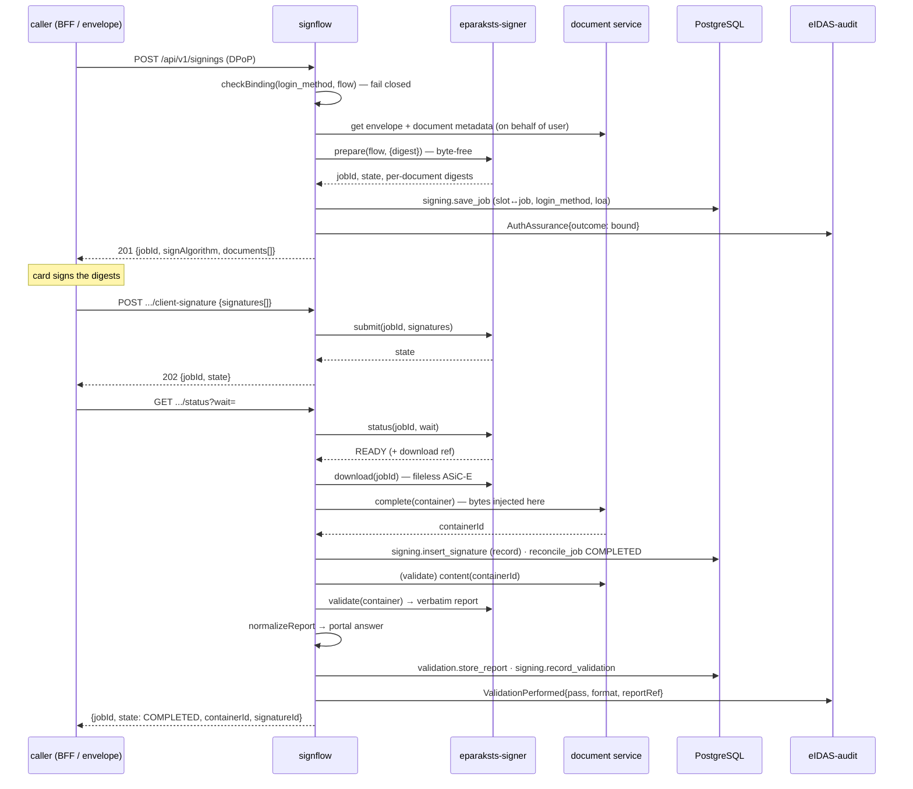
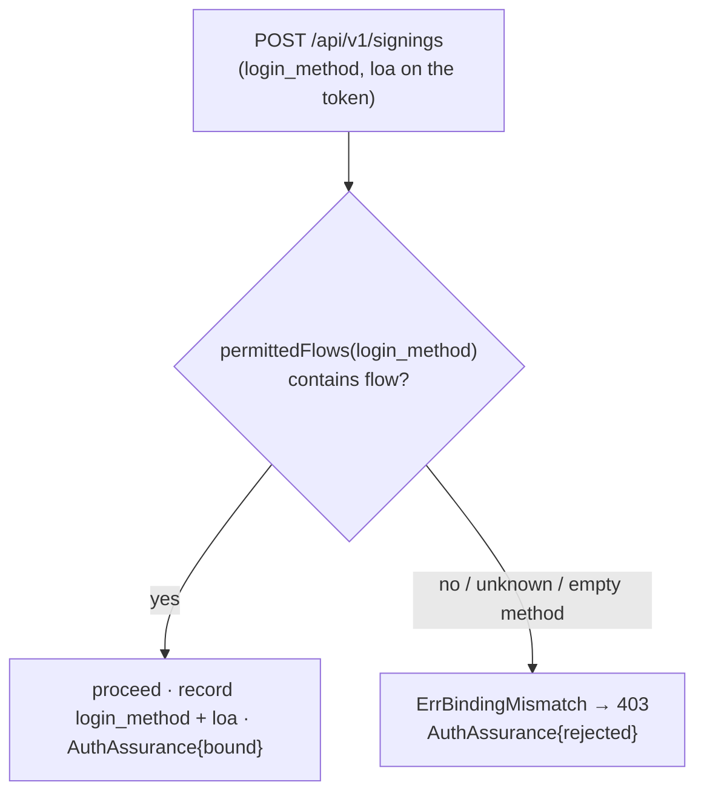

# signflow

The **signing conductor** of the signing portal — the service that turns a *"sign this slot with this flow"* request into a completed, validated signature. It is the brain of a signing operation: it decides *how* a slot is signed, drives the signing provider through the multi-step signing dance, reconciles the result back onto the document and the envelope, owns the durable **signature record**, and owns the **validation answer** the portal shows the user.

It **conducts but does not hold**. The document bytes and their canonical digests live in the document service; the signing session, certificate selection, and the cryptographic signing itself live in the signing provider (eparaksts-signer); the multi-slot workflow state lives in the envelope service. signflow holds **no QTSP credentials, no signing keys, and — on the hash-only path — no document bytes at all**. What it owns is the *choreography* and the portal-side truth of what happened: which slot was signed, with which flow, under which login, and whether the resulting container validates.

Two signing paths run through the same conductor, chosen by the source document's form, not by the client:

- **Byte-free hash-only XAdES / ASiC-E** (ETSI EN 319 132-1 / ETSI EN 319 162-1) — only the document **digest** transits signflow. The provider returns a *fileless* container; the document service injects the source bytes and assembles the final ASiC-E. The bytes never touch signflow.
- **Byte-conduit PAdES** (ETSI EN 319 142-1) — a PDF signature is embedded incrementally and has no hash-only mode, so the document bytes pass **transiently** through signflow to the provider and the signed PDF is stored back. signflow buffers nothing durably.

Every signing is gated by a fail-closed **login⇒signing binding**: the login method carried on the caller's token must permit the requested signing flow, or the request is refused before any provider work begins. signflow is also a **signing-evidence audit producer** — it records the binding it established and the validation answers it computed as lean, PII-free lifecycle events.

Its HTTP surface is DPoP-gated and cluster-internal: the envelope/workflow service and the portal backend-for-frontend call it. It renders no human UI.

---

## Where it sits

signflow is one service in the signing platform. It is driven by the portal backend-for-frontend and the envelope/workflow service, and it conducts three collaborators plus one audit sink. It never talks to a wallet, a browser, or a QTSP directly — it routes.



Division of labour: the provider owns the trust-service session, certificate selection, the redirect dance, and the signature; the document service owns bytes, canonical hashes, and container assembly; the envelope service owns the workflow. signflow owns the *decision and the record* — the binding gate, the format routing, the co-sign concurrency rules, the signature record, and the normalized validation answer. It meets the provider and the document service as DPoP service calls (its own identity to the provider, **on behalf of the signing user** to the document service, since the document is the user's).

---

## HTTP surface

The public probes return a plain `{status}` body; everything under `/api/v1` is DPoP-gated (go-authbyte; audience `svc:signflow`) and returns the platform problem envelope (RFC 9457) on error. Each authenticated endpoint requires a `signatures:<level>` scope.

| Method + path | Scope | Purpose |
|---|---|---|
| `GET /healthz` | — | Liveness — 200 whenever the process is up |
| `GET /readyz` | — | Readiness — 503 (`{status:"not_ready"}`) when the signing/validation store is unreachable |
| `POST /api/v1/signings` | `signatures:create` | Begin signing a slot: `{envelopeId, slotId, flow, sigFormat, documentId, …}` → `{jobId, state, authorizeUrl?}` (redirect flows) or `{signAlgorithm, documents[]}` (in-browser digests to sign) |
| `GET /api/v1/signings/{jobId}/status?wait=` | `signatures:read` | Reconciled provider status; optional long-poll. On the first ready turn it assembles the container, records the signature, validates, and reports evidence — then idempotent → `{jobId, state, verificationCode?, verificationMessage?, signingDeadline?, containerId?, signatureId?}`. `verificationCode`, `verificationMessage` + `signingDeadline` (epoch ms) ride along during the device-push confirmation window (eID Scan) — the code and prompt the user matches on their phone before authorizing |
| `POST /api/v1/signings/{jobId}/client-signature` | `signatures:write` | Submit the in-browser (Web eID) client-produced signature value(s) → `{jobId, state}` |
| `POST /api/v1/signings/{jobId}/abandon` | `signatures:write` | Release a signing attempt's chain lock **without** declining the slot (the signer cancelled at the provider and will retry); owner-checked, idempotent |
| `GET /api/v1/chain-free?envelopeId=&wait=` | `signatures:read` | A blocked co-signer's long-poll: block up to `wait` seconds (capped) until the PDF chain's active-signer lock frees → `{free}` |
| `POST /api/v1/validations` | `signatures:read` | Validate / re-validate a recorded signature on demand → the normalized validation answer |
| `POST /api/v1/document-validations` | `signatures:read` | Validate a signed document ON DEMAND (an uploaded already-signed file, or any signed head) → the normalized answer, returned without persisting anything (the durable answer stays the one recorded at signing) |
| `POST /api/v1/archive-timestamps` | `signatures:write` | Refresh a signed document with a qualified archive timestamp (B-LT → B-LTA): fetch the signed head on the user's behalf, have the provider embed an `ARCHIVE_TIMESTAMP`, store the archived form back in place (same document id). `{documentId, authCertificate}` — the auth certificate is the signed-in user's, relayed to the provider so the timestamp request is made in the acting user's name |

Signing **flows** (`flow`): `webEid`, `eidScan`, `eparakstsMobile`, `eparakstsMobileEseal`, `csc`. Signature **formats** (`sigFormat`): `XAdES`, `PAdES`. The in-browser `webEid` flow additionally requires the card's `signingCertificate` + `authCertificate` (public certificates, request-scoped — never persisted or logged); the redirect flows carry `postAuthRedirect` / `authErrorRedirect` return URLs with a `{jobId}` placeholder, and may carry the caller's login-captured identity (`signIdentityId` + the certificates, plus `sealId` picking which seal signs) — all pass-throughs to the provider, which then skips its own identity resolution; absent, the provider resolves identities itself.

---

## Architecture

`New()` wires every dependency once at startup and **degrades explicitly**: without a store DSN it uses an in-memory store (dev), without both a signer and a document base URL the signing routes report not-ready, and without a broker the audit recorder is a no-op. Cross-cutting concerns (structured logging with redaction, OpenTelemetry tracing, correlation) are installed once by the shared platform-kit and are never wired per-service.



### One signing, end to end

A Web eID (in-browser) hash-only XAdES signing, from begin to validated record. A redirect flow (`eparakstsMobile` / `csc`) replaces the client-signature step with an `authorizeUrl` the user visits; a PAdES signing swaps the byte-free `Complete` for a byte-conduit `StoreSignedDocument`.



The slot↔job mapping is persisted **before** any redirect is returned, so reconciliation survives the user's round-trip even on another instance. Finalization is idempotent: the job is marked conductor-terminal (`COMPLETED`) before the best-effort validation runs, so a replayed poll never records a second signature. The at-signing validation is best-effort — a validation hiccup leaves the signature recorded-but-unvalidated and re-validatable via `POST /api/v1/validations`.

---

## Login⇒signing binding

The authentication method a session logged in with **gates** which signing flow it may drive. The gate is fail-closed and runs in `Begin` before any provider work:



| Login method | Permitted signing flows |
|---|---|
| `webEid` | `webEid` |
| `eidScan` | `eidScan` |
| `eparakstsMobile` | `eparakstsMobile`, `eparakstsMobileEseal`, `csc` |
| *(unknown / empty)* | *(nothing — the binding permits nothing)* |

A mismatch returns `err:signing:bindingMismatch` (403) with a deliberately terse detail — the caller must re-authenticate with the method that matches the flow, and signflow reveals no more. The binding mirrors the same rule the authentication service enforces at login, so the two never diverge; the fine-grained signing credential within a flow is resolved by the provider, not here.

Both the **login method actually used** and the **level of assurance** (eIDAS LoA, Regulation (EU) No 910/2014) are copied from the session token onto the durable signing job and the signature record, giving each signature the precise evidence *"authenticated via X, signed via Y, at assurance Z."* Every binding decision — bound **or** rejected — is emitted as a PII-free assurance audit event; the rejection is itself evidence.

---

## State and data model

signflow's durable state lives in PostgreSQL across a `signing` schema (signing jobs, signature records, the co-sign chain lock) and a `validation` schema (normalized validation reports). **The service never touches a table.** Every operation is a `CALL` to a `SECURITY DEFINER` procedure that takes and returns a uniform JSONB envelope (`result` / `data` / `code` / `message`); signflow's database role has **`EXECUTE`-only** grants (the `signing_public` role) and cannot read or write tables directly. A structured procedure error (`<domain>:<reason>`, re-raised with SQLSTATE `P0001`) maps back to a sentinel — `:not_found` → 404, `:duplicate` → 409. An in-memory backend implements the same contract for dev/test.

| Procedure | Purpose |
|---|---|
| `signing.save_job` | Persist the slot↔job mapping (+ `login_method`, `loa`) before the redirect |
| `signing.reconcile_job` | Idempotently advance a job's state (provider state, then conductor-terminal `COMPLETED`) |
| `signing.get_job` | Read one job (ownership + on-behalf subject resolution) |
| `signing.insert_signature` | Record an applied signature (the signature record) |
| `signing.get_signature` | Read one signature record |
| `signing.record_validation` | Link a normalized validation result onto a signature record (idempotent) |
| `signing.acquire_chain_lock` / `release_chain_lock` / `chain_lock_status` | The PAdES co-sign concurrency gate (single active signer per chain, TTL backstop) |
| `validation.store_report` | Persist the normalized validation answer, return its id |

**The signature record** is the portal-side truth of one applied signature: the slot and envelope it belongs to, the flow used, the signature format, the signed-document reference (an ASiC-E container id for XAdES, a signed-PDF id for PAdES), the binding evidence (`login_method` + `loa`), and — once validated — a link to the normalized report and the pass/fail verdict.

**The validation report** is the portal's *normalized* answer, not the provider's raw output. The provider relays an upstream validation report verbatim (ETSI EN 319 102-1 status indications via a DSS-shaped envelope); signflow maps it onto a stable field set — an overall verdict (`PASSED` / `INDETERMINATE` / `FAILED`), the signature profile and legal-meaning level (QES / SEAL / AdES), signer identity and serial/registration, signing time, revocation-data time, long-term-validity horizon, the signed-file list, and every signature in a multi-signature container. The **verbatim report is never stored** — only the normalized answer is the durable evidence. Signer identity and serial are persisted in the clear and returned to the owner on request (masking is a UI concern); they are deliberately **kept out of the lean audit event**.

### Co-signing

An envelope can gather several signatures on one document. The two formats co-sign differently, and signflow enforces the difference from the source document's form (never re-guessing from a client hint):

- **XAdES / ASiC-E — parallel, mergeable.** Each co-signature is computed independently over the container's inner data objects and merged with a keep-latest optimistic CAS. If the chain head advanced under the merge, the already-computed signature is re-submitted onto the new latest (bounded retries); exhausting them surfaces as a recoverable `chainAdvanced` conflict.
- **PAdES — sequential, not mergeable.** A PDF signature is embedded incrementally, so only one signer may hold a chain at a time. A concurrent signer is refused (`err:signing:inProgress`, 409) and waits on `/api/v1/chain-free`; the lock is refreshed on each status poll, released on finalize/abandon, and expires by TTL as a crash backstop. Once the lock frees, the next signer signs the chain's **current head** (the prior signer's signed PDF, resolved server-side — never a stale client id), and the store **keep-latest supersedes** it in place. The document service's one-signed-PDF-per-chain constraint is the correctness floor beneath this UX gate.

---

## Configuration

Standard platform env (`SERVER_URLS`, `SERVICE_NAME`, `ENVIRONMENT`, `LOG_*`, `METRICS_ENABLED`, `OTEL_*`, `BROKER_URL`) comes from the shared base configuration, plus:

| Env var | Default | Meaning |
|---|---|---|
| `AUTH_ISSUER_URL` | — (required) | Inbound DPoP token issuer (the `iss` for both inbound validation and outbound minting) |
| `SERVICE_AUDIENCE` | `svc:signflow` | Audience this service validates inbound tokens against |
| `SIGNER_BASE_URL` | — | Signing provider (eparaksts-signer) base URL. With `DOCUMENT_BASE_URL`, gates the conductor; unset → signing routes report not-ready |
| `DOCUMENT_BASE_URL` | — | Document service base URL (metadata / assembly / content) |
| `ENVELOPE_BASE_URL` | — | Envelope/workflow service base URL; unset → slot-completion notification is skipped (single-document path) |
| `SIGNER_AUDIENCE` | `svc:eparaksts-signer` | Outbound service-token audience for the provider |
| `DOCUMENT_AUDIENCE` | `svc:document` | Outbound service-token audience for the document service |
| `ENVELOPE_AUDIENCE` | `svc:envelope` | Outbound service-token audience for the envelope service |
| `SERVICE_CLIENT_ID` | `svc:signflow` | Outbound service-client id (mints DPoP service tokens) |
| `SERVICE_CLIENT_SECRET` | — | Outbound service-client secret. Secret: supports the `SERVICE_CLIENT_SECRET_FILE` convention (an explicit env value still overrides it) |
| `OUTBOUND_ISSUER_URL` | — (⇒ `AUTH_ISSUER_URL`) | In-network token-mint address; the token `iss` stays `AUTH_ISSUER_URL` |
| `SIGNING_STORE_DSN` | — (⇒ in-memory) | PostgreSQL DSN; connects as the `EXECUTE`-only `signing_public` role. Empty → in-memory store (dev/test; jobs do not survive restart). Pool size comes from the DSN itself — `pool_max_conns` (pgx reads it and strips it before Postgres sees it; its default is the host's CPU count): set it explicitly to the deployment's connection budget, e.g. `?sslmode=…&pool_max_conns=4&pool_min_conns=1`. |
| `EIDAS_AUDIT_TOPIC` | `audit.signing` | Broker topic for signflow's lifecycle/validation evidence (shared with the provider so both feed one hash-chain) |
| `EIDAS_AUDIT_OUTBOX_DIR` | — | When set, audit emission is durable + non-blocking: events spool to this directory and a background drainer publishes them + flushes on shutdown. Unset → synchronous publish (dev) |

The signing routes are not-ready until **both** `SIGNER_BASE_URL` and `DOCUMENT_BASE_URL` are set; the outbound DPoP client is built when at least one collaborator base URL is present.

---

## Directory layout

```
signflow/
├── app.go, config.go       — App container (New/init/Start/Stop), configuration + secret loading
├── testing.go              — TestApp + header-driven stub auth middleware (test harness)
├── cmd/server/             — CLI entrypoint: web (default) + health subcommands
├── routes/                 — HTTP handlers
│   ├── signings.go   — begin · status · client-signature · abandon · chain-free · validate; scope + error mapping
│   ├── router.go     — route registration (public probes + DPoP-gated /api/v1)
│   ├── types.go      — request/response wire shapes
│   └── health.go     — healthz · readyz
├── orchestrator/           — the conductor
│   ├── orchestrator.go — Begin → Reconcile/finalize → Validate · Abandon · WaitChainFree; co-sign rules
│   ├── binding.go      — login⇒signing permittedFlows gate (fail closed)
│   └── validation.go   — verbatim provider report → normalized portal answer
├── clients/                — outbound DPoP clients (framework-free)
│   ├── clients.go    — Doer + on-behalf transport; typed HTTPError
│   ├── signer.go     — signing provider (prepare · status · submit · download · validate)
│   ├── document.go   — document service (metadata · data-objects · complete · store-signed · content)
│   └── envelope.go   — envelope service (get envelope · mark slot signed)
├── store/                  — durable state (signing + validation schemas)
│   ├── store.go      — the Store contract + row types (Job, Signature, Report)
│   ├── postgres.go   — SECURITY DEFINER procedure calls over the EXECUTE-only role
│   └── memory.go     — in-memory backend (dev/test)
├── audit/                  — eIDAS-audit producer (assurance + validation events) + outbox drain task
└── Dockerfile              — static binary → rootless scratch (nonroot)
```

---

## Development

There is no Makefile — the unit suite runs entirely against in-process fakes (the in-memory store, a stub outbound doer, and a header-driven stub auth middleware), so no Docker, database, or network is needed:

```bash
go build ./...                # build (matches the Dockerfile's prod build)
go test ./...                 # unit tests — in-memory store + stub collaborators
go vet ./...
docker build -t signflow .    # CGO-free static binary → rootless scratch (nonroot)
./server web                  # serve (default subcommand)
./server health               # container healthcheck probe (hits /healthz)
```

`TestApp` builds a fully wired `App` with no collaborator URLs and a stub auth middleware; test requests carry scopes and binding claims via `X-Test-Scopes` / `X-Test-Sub` / `X-Test-Login-Method` / `X-Test-LoA` headers (production always uses the go-authbyte DPoP middleware).

---

## Security invariants

- **Fail-closed binding gate** — a signing cannot begin unless the session's login method permits the requested flow; an unknown or absent method permits nothing. Every decision (bound or rejected) is recorded as evidence.
- **Byte-free hash-only path** — for XAdES/ASiC-E only the document digest transits signflow; the bytes stay in the document service, which assembles the container. The PAdES byte conduit is transient and buffered nowhere durably.
- **No credentials, no keys** — signflow holds no QTSP credentials and no signing keys; it routes to the provider, which owns the signing session and certificate selection.
- **On-behalf-of, fail-closed** — document and envelope reads act on the signing user via token exchange; a call without a subject token cannot reach a user-owned document (no fallback to signflow's own identity).
- **Tables are never touched** — all durable state goes through `SECURITY DEFINER` procedures under an `EXECUTE`-only role.
- **Evidence integrity** — the verbatim provider report is never stored (only the normalized answer is); audit events are lean references — no bytes, no certificates, no report contents, no signer names — and emission is best-effort so it never blocks or rolls back a signing.
- **Idempotent finalization** — the job is marked conductor-terminal before validation runs, so a replayed poll never records a second signature.

---

## Known limitations

- **Slot → document resolution is server-authoritative.** The begin request still carries a `documentId`, but for an envelope-backed slot signflow does not trust it: it takes the chain **root** from the envelope, then resolves that chain's **current live head** from the document service (`GET /documents/{root}/head`) and signs that — so a co-signer whose client holds a stale id still signs the head the prior signer produced. It signs the root only when no signed head exists yet, and fails rather than guess if the head cannot be resolved.
- **At-signing validation is best-effort.** A validation failure at signing time leaves the signature recorded-but-unvalidated; the answer is obtained later via `POST /api/v1/validations`. There is no hash-only validation path — validation always fetches the full signed container (a deliberate byte transit, distinct from the byte-free signing path).
- **The provider report shape is not contractual.** signflow maps known status indications and level codes to the portal vocabulary and passes an unrecognized code through unchanged rather than guessing; a timestamp it does not recognize is returned as-is.
- **No custom metrics** beyond the platform-kit defaults are exported yet.
- **The in-memory store is dev/test only** — signing jobs and records do not survive a restart; production requires `SIGNING_STORE_DSN`.
---

## Contributing

Bug reports and pull requests are welcome. [CONTRIBUTING.md](CONTRIBUTING.md) names the gate a
change has to pass, the invariants a change to the signing path must not weaken, and the sign-off
every commit carries.

Suspected vulnerabilities go through the private route in [SECURITY.md](SECURITY.md) — never a
public issue. This service decides whether a legally effective signature may be produced and what
gets signed, so that file also says which failures we treat as most serious.

## Licence

**GNU Affero General Public License, version 3 only** — see [LICENSE](LICENSE).

This is a network service, so the clause worth knowing is the one MIT and GPL do not have: if you
run a modified version and let others interact with it over a network, you must offer those users
the corresponding source of your modified version. Running it unmodified, or modifying it for
internal use with no network users, does not trigger that.
